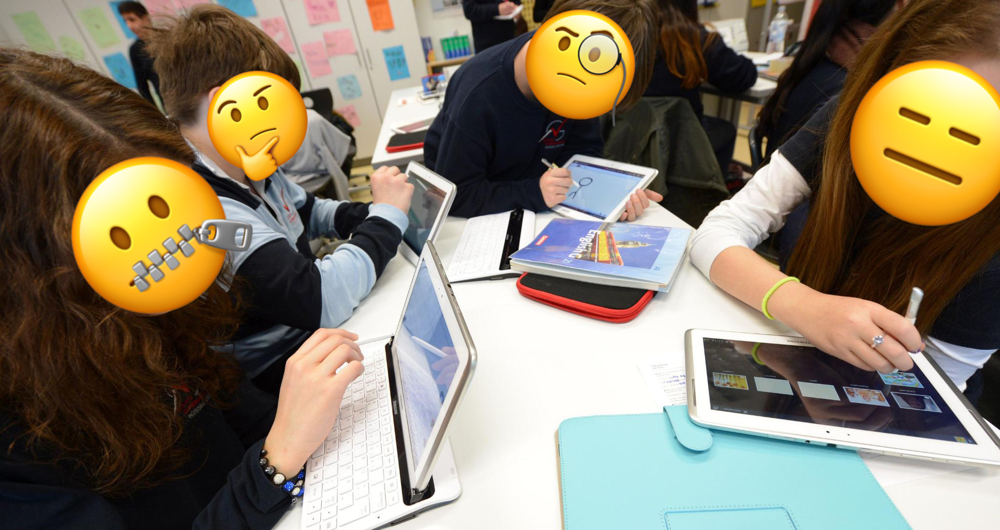
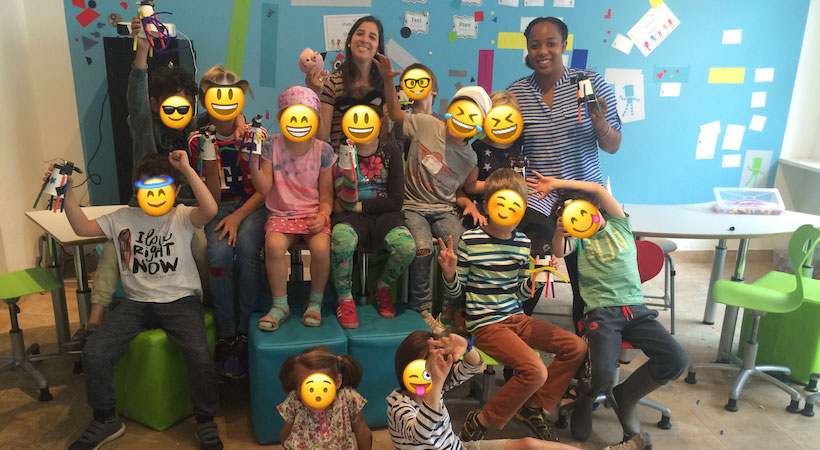

theme: Scherzkeks, 1

^ Welcome to my talk

^ About CODING KIDS and SCREAMING CARROTS

^ And just to make sure. In this presentation I talk about kids in the age from 6 to 12 years.

^ I hope you enjoy it.

# About
# [fit] _**Coding Kids**_
## and
# [fit] _**Screaming Carrots**_

---
^ My name is Georgios Kaleadis

^ I'm 34 years old

^ and I live in Munich working for Sinnerschrader as a Principal Frontend Developer

^ In my spare time I teach coding to kids

^ which inspired me so much that it brought me to this stage today.

^ I'm also Origami addicted...

# [fit] Georgios Kaleadis
+ Living in Munich, born 1984
+ Principal Frontend Developer for Sinnerschrader
+ Kids Coding Trainer
+ Origami addicted

---
^ ...since Takeshi taught it to me in front of Osaka castle two years ago.

^ Today I fold nearly every day

^ and I also created a project about virtual origami folding

---
[.background-color: #fdc552]

^ Let's start.

^ First some nostalgia fun with me as the coding kid.

# [fit] *Nostalgia Fun*
## *with*
# [fit] *The coding kid*

---
^ To make sure you have some inner picture. That's me. I'm ten years old.

# [fit] That's me

---
^ It's 1994. I call this chapter of my life Magazine Hoarder

^ For a reason.

# [fit] **_1994_**
## [fit] Magazine Hoarder

---
^ At that time I love to play with my Super Nintendo and Sega Game Gear.

---
^ My favourite place to be, month by month, is the store with the huge shelf of magazines.

---
^ Most magazines had some CD attached.

^ The ones about computers contained applications, trials, drivers & patches.

^ Why? Because internet was not available to everyone.

^ Could I use those CDs ?

# [fit] Drivers
# &
# [fit] Patches
---
^ Not at all.

^ I didn't even owned a computer yet.

---
^ I only got in touch with real computers

^ when my sister took me to her agency office.

^ There I had the opportunity to tinker around with a Mac running the wonderful OS 9.

---
^ Photoshop was my favourite application.

^ I created dozens of those galaxy spirals.

---
^ Let's jump to 1997, the year of my first PC.

# [fit] **_1997_**
# [fit] My first PC
---
^ Actually I had to wait until Christmas 1997.

^ It's now three years since I bought my first magazine.

---
^ My computer was running Windows 95 and had a 4GB hard disk.

^ This thing had of course no internet.

^ And what does a kid do with a computer ?

---
^ Of course. Playing games.

^ It's 1998 and I enjoyed my new computer day and night.

# [fit] **_1998_**
# [fit] PC Gaming
---
^ My very first game I bought was Blade Runner from Westwood Studios.

^ It was distributed on 4 CDs and consumed half of my disk space.

---
^ Let's hurry to 1999. The year I got my internet access.

# [fit] **_1999_**
# [fit] Internet

---
^ I had a 56k modem to connect.

^ Which was slower than your throttled dataplan on your smartphone.

^ Let's listen to the iconic sound for a quick flashback.

^ After Video: I still can’t believe the internet worked back then.

---
^ Some day in April 1999.

^ I was watching my favourite tv station **NBC Giga**

^ Where they talk about games and computers

^ This particular day two guys were showing a new application

---
^ They let a red ball bounce around.

^ It must have looked like this.

---
^ I was impressed

^ They mentioned the name of the application.

^ But I had to hurry back to afternoon school and didn't write it down.

^ After school I wanted to search for a trial version on all of my magazine cds.

# 😲
# [fit] I was impressed

---
^ But I forgot the name.

^ The week went by quickly.

^ It is Saturday

# [fit] I forgot the name
# 😔

---

^ This means getting up as early as possible

^ and watching series like Saber Rider, Captain Future or Duck Tales.

^ Around lunch time..

---
^ I watched Giga TV again

^ And I could not believe it.

^ It was the repeated show from earlier of the week.

^ ---> I was frozen in front of my ..... TV

---

^ I holded my breath

^ I waited for the moment they would tell me that name I forgot.

^ and then

---
^ There it was.

---
^ It was Macromedia Flash 4. Released just weeks before.

---
[.header: text-scale(0.5)]
^ This moment just now?

^ This was the genesis of my programming career.

# [fit] Genesis
## of my
# [fit] **_programming career_**

---
^ Flash looked like this.

^ A timeline, some layers and tools.

^ And of course the stage where you can see things move around

---
^ I quickly found the place to code.

---
^ Soon I was able to program the very famous Yugop Menu

^ It's an horizontal navigation with the illusion of infinity.

^ I was so good in programming this thing...

# [fit] Yugop Navigation

---
^ ...that I could sell it to agencies.

^ To earn my first money with 15 years.

---
^ It was an amazing time full of amazing websites

^ What you see here is THE PORTAL from derbauer.

^ Yes this was a website.

^ Stuff like this drove my ambition to get me where I am today.

---
^ So what's my point you're asking?

# [fit] So what's my **_point_** ?

---
^ Remember the genesis of my programming career in front of the TV ?

^ I wish I would have had some guidance during school

^ So that more than a single moment in front of the TV would have guided me to my career.

---
^ Instead

^ The most digital thing I had in primary school was this

---
^ Later the computer classes I remember were more like this.

---
^ Computer classes today are still bad.

^ The hardware, if any, outdated

^ Most teachers are not educated

^ The curriculum is boring

---
^ I want to make a difference and change things
# [fit] Make a
# [fit] difference
---
^ That's why I'm teaching kids coding in my spare time

^ And I want you to know why I am doing this

^ and that you can do it too.

---
[.background-color: #fdc552]
^ So for the next 20 minutes I will talk about

^  1. Why coding matters.

^  2. How to teach it.

^  3. and where to teach it.

# [fit] _1. Why it matters_
# [fit] _2. How to teach_
# [fit] _3. Where to teach_

---
[.background-color: #fdc552]
^ So why does coding for kids matter at all?

^ Let's start with something easy.

# [fit] _1. Why it matters_
# 2. How to teach
# 3. Where to teach

---
^ We all can describe to a child how a combustion engine works more or less.

^ Right?

# _**combustion engine**_

---
^ We can tell how the human body works.

# _**human body**_

---
^ But when you a press the play button a youtube video.

# _**youtube play button**_
---
^ Yeah. What would you tell that kid :)

^ It's hard for many of us.

^ It's like something was missing in school.

^ So let's fix this for our children by...

# what would **_YOU_** tell that kid?

---
^ ...teaching - coding - to - kids-

^ The whole world is talking about it.

> _"teaching - coding - to - kids"_
-- everybody talks like this

---
^ It's like people are concerned about the future of our kids.

# [fit] Concerned

---
^ or that we fear that technology leaves us behind

^ No matter what, the demand is the same...

# [fit] Fear of
# [fit] Technology

---
^ ...Our kids should learn coding.

^ Is this justified?

^ I’m biased in this question for obvious reasons.

^ So let's step back and take a look at the bigger picture.

# [fit] Kids
# **_should learn_**
# [fit] coding

---
^ We start by looking at a mechanic

^ and apply the whole coding discussion onto it.

^ It goes like this:

# [fit] _**The mechanic**_

---
^ It's sort of like an **obsession** with being an **auto mechanic**

<!-- This is mechanic comparison is coming from npr.org -->
# [fit] _**Obsession**_

---
^ There are **tons of cars**, there's tons of **driving** ...

# [fit] **_Tons of cars_**

---
^ but I think it's a little **silly** to go around saying
#### little
## **_silly_**

---
^ that **everyone**  should **_really_** learn to be an auto mechanic
# [fit] _**Everyone**_

---
^ just because cars are so **_essential_** to the **functioning** of our society.

# [fit] **_Essential_**

---
^ Yeah! That would be silly indeed.

^ But what do we do?

# [fit] **_Oh Yeah!_**
# [fit] that would be silly indeed

---
^ There is tons of technology

^ and we go around and tell everybody how important coding is.

---
^ So are we silly then?

^ Or..

^ Are we just talking about something else than coding?

# [fit] ArE wE **_silly_**?!

---
^ What if the **word coding** is born out of **confusion**?
# [fit] ~~coding~~

---
^ The question is: What do people actually mean with coding.

# What do people actually mean with **_coding_** ?

---
^ In 1943 Konrad Zuse built his famous Z3

^ And together with it the very first programming language called Plankalkuel

# [fit] **_Plankalkuel_**
# [fit] _**1943** Konrad Zuse_

---
^ The Z3 looked like that.

^ Technology escalated then pretty quickly

---
^ With your smartphone you hold a device that combines everything we learned in the past 70 years.

^ That’s a lot and very complex

^ It makes computer science not easy to talk about.

# [fit] _70 years later_
# **_Technology is complex_**

---
^ Coding on the other side is easy to grasp.

# [fit] Coding?
## **_Sure, I know that_**

---
^ Take someone

^ Add a keyboard

^ And watch that person giving commands to a computer.

^ That’s coding and the people understand it.

---
^ If coding is such an easy word

^ Maybe that's why it's mixed up.

^ Let’s try a theory.

# Let's try a
# [fit] _**Theory**_

---
[.header: text-scale(0.5)]
^ When people talk about coding they actually mean technology.

## When people talk about
# [fit] **_coding_**
## they actually mean
# [fit] **_technology_**

---
^ And people demand our kids not to learn coding

^ they actually say "our kids need to learn technology"

# our kids need to learn
# [fit]  ~~coding~~ **_technology_**

---
^ The whole coding discussion suddenly makes sense.

# [fit] The Discussion
# **_suddenly makes sense_**

---
<!-- -- via kidscodecs.com -->

^ It's not about coding anymore

^ It's about exposure to technology, computer science and programming

^ so kids can understand the bigger picture, the connecting lines.

^ Most of the kids will never be a coder anyway.

> **_Exposure to technology_**, computer science and programming.

---
^ Our children should learn that smartphones and technology are not magical.

^ That there are limitations, benefits and possibilities from using them.

## [fit] _**no magic**_

---
^ Teaching Coding still makes sense

^ It's only one part of understanding technology

^ but you benefit in many ways when you learn to code.

## [fit] **_Learning to Code_**
## still makes sense

---
^ It stretches your mind

^ and it creates a thinking which is useful in all domains.

> "Learning to write programs **_stretches your mind_**.."
-- Bill Gates

---
^ As a coder

^ you make the transition from being a consumer to a producer

^ who can tell stories and create own worlds in the computer

## [fit] **_be a producer_**
## not a consumer

---
^ The room for creativity is endless.

^ It’s like painting and music but often more accessible and affordable.

# [fit] Coding
## is like
# [fit] _**painting & music**_

---
^ Speaking of affordable. Coding gives you chances.

^ Computer's are cheap nowadays.

^ Even poor kids can afford it.

## [fit] Chances

---
^ Diversity. The computer just don't care who you are.

^ Everybody can become a coder.

## [fit] Diversity

---
[.background-color: #fdc552]
^ I hope I have convinced you by now why teaching coding matters

^ So let me show you some possibilities how to teach kids about technology and computer science.

# ~~1. Why it matters~~
# [fit] _2. how to teach_
# 3. where to teach

---
^ I will present you now a list of my favourite tools I love to use when teaching

^ It's about Tinkering, Robots and actual Coding

# _**My favourite toolset**_

# [fit] Tinkering, Robots, Coding

---
[.background-color: #fdc552]
^ Let's have a look at Tinkering.

^ This is all about playing around with electronics.

## [fit] _Tinkering_

---
^ For example with a drawbot.

^ This is a toy that every kid starting with 4 years can build by himself.
## [fit] Drawbot

---
^ The parts cost less than 2 EUR

^ You have three legs made of pens, a battery and a rotating motor.

---
^ When activated the robot will vibrate

^ and start walking around drawing on the underlying surface

^ This looks like real art in the end

^ It's so much fun for the kids to watch their robot to be alive.

---
^ A Makey Makey

^ Its simplicity is awesome.

## [fit] Makey Makey

---
^ It’s basically an electronic board that pretends to be a computer keyboard.

---
^ When two connected objects touch each other

^ they close a circuit on the MakeyMakey

^ and you virtually press a defined key

^ And what can you do with it?

---
^ Build a Super Mario Controller

^ Find a mario game that you can control with your keyboard

^ Take some play Dooh - which is suprisingly conductive

^ and design your own game controller to move and jump.

---
[.background-color: #fdc552]
^ Programable Robots!
## [fit] _Robots_

---
^ They are everythere

^ Many of them can be programmed with child friendly programming language.

^ Let me show you some.

---
^ Say hello to Dash & Dot.

^ Those are robots with many sensors, LEDs and speakers.

^ Together they cost around 200 EUR

# [fit] Dash
# &
# [fit] Dot

---
^ You can use the app WONDER where everything is about exploring and adventures.

^ You don't create programs but you solve missions by using commands for light, sound or movement.

---
^ There is also an app where you have more of a coding experience.

^ This gives the kid a focus on their own creativity with the robots.

---
^ mbot- my favorite robot.

## [fit] mbot

---
^ He's based on Arduino uno and OpenSource.

^ This means you could theoretically create all parts yourself and use the software for free.

^ You can of course buy it as a package for 80 EUR.

^ What's so special about it ?

---
^ That the kid will assemble it.

^ Usually within 20mins

^ You can then start an automatic program, use an app or code your own program.

---
^ When you activate the autonomous driving mode.

^ It will use its ultrasonic and special line sensor

^ to follow a line and avoid obstacles in front if it.

---
^ Let’s look how coding is being teached.

^ You usually tackle it in three different parts.

^ Analog activity, playing games and dive into the actual coding experience.

## [fit] Coding

---
^ Let's look at the analog activity.

^ If you want to control a robot you have to behave like a robot first.

^ So let's play the human robot game.

## [fit] The Human Robot

---
^ One kid or you dresses up as a robot.

^ A helmet is usually enough for the illusion but a full costume like this is never wrong.

^ You explain the kids in the round that they can only use five commands to control the robot.

^ forward, turn left, turn right, backward and stop

^ Let's begin

---
^ Imagine this task:

^ You want the robot to turn to the right and walk in that direction.

^ So you begin with a turn right, right?

^ Let's see what happens after the kids yell that command to the robot.

## $ROBOT: **_<TURN RIGHT>_**

---
^ The robot will spin forever and ever and ever of course.

^ The command was correct but not exact enough.

^ They should have said turn right - a quarter.

^ While spinning around, somebody will hopefully scream a `stooooop` to the desperate robot

---
^ In the end kids really love that game, collaborate and understand the limits of a machine

^ They also understand the requirement of exact commands

^ And to put one command after another - just like in programming.

---
^ Your crowd is ready for some more fun.

^ Let’s play some coding games.

## [fit] Coding
## [fit] Games

---
^ There is a movement called Hour of Code to do so

^ There are dozens of one-hour games and tutorial translated in 45 languages.

^ Everybody is encouraged to try it out.

## [fit] Hour of Code
## **_one-hour tutorials_**

---
^ The games are themed after kid’s darlings like Ice Princess Elsa, Minecraft or Angry Birds.

^ And they teach the principals of programming while playing.

---
^ I usually pick a labyrinth style game to follow up with the human robot example.

^ This is the Zombie Level where a zombie has to be guided to his favorite food.

^ A sunflower of course!

---
^ Commands are given with colorful blocks and snapped together like in a puzzle.

^ You use a simple set of commands to do so.

^ Like move forward, turn left, turn right

## [fit] _**Commands**_

---
^ Kids will usually place one command after the other

^ That's simple and it's working

^ But it results in a huge list

^ They can’t even complete the level as they are forced to use a new block.

^ The pink one here which is used to repeat commands.

---
^ I then show them the pattern of 4 blocks they can repeat instead of the huge list.

^ forward, left, forward, right

^ and let them reorganize their code

---
^ And success! They usually just know what to do.

^ Pick the pink loop block and place the repeating pattern inside.

^ I love this moment.

---
^ I explain that this is what a computer is for.

^ The computer should repeat the boring stuff, it's not your task.

^ After an hour the kids should have internalized those block based commands...

---
^ and they are ready for Scratch to do some real coding.

^ Scratch is the most famous tool in kids programming.

---

^ It was invented by Mitchel Resnick at the MIT Media Lab in 2002.

^ Scratch can be used as an application or online in the web browser through flash.

^ The next version 3 is based on HTML5 and will be released this August.

---
^ Everything you code can be shared on the Scratch website

^ and remixed by others as the `source code` is always accessible.

---
^ Let's have a look inside Scratch

^ 1. On the left you have a stage where everything will move around.

^ 2. And on the right you see the coding editor.

^ That's where you code with colorful blocks

^ This is called block based programming.

---
^ and to complete this section I brought you something special

^ > A screaming carrot <

^ It's programed in Scratch, will make use of MakeyMakey

^ and is the obvious reason for the sensational title of this talk

---
[.background-color: #fdc552]

^ That was fun, wasn't it ?

^ What’s left is the question where **everybody** could try teaching coding.

# ~~1. Why it matters~~
# ~~2. How to teach~~
# [fit] _3. Where to teach_

---
^ I want to stress the word everybody.

^ You don’t have to be a programmer

^ Everybody can learn coding and everybody can teach about coding or robots.

# [fit] **_Everybody_**
# can
# [fit] teach

---
^ I started teaching coding to kids in my spare time exactly one and a half year ago at Haba Digitalwerkstatt.

^ They started in Berlin in 2016 and opened an office in Munich in 2017

# [fit] Digitalwerkstatt

---
^ Their schedule is about coding with Scratch, Robotics, Stop Motion movies and exploring worlds in Minecraft.

^ If you want to try it, just drop them a mail like I did.

---
## [fit] Hour of Code
^ You could also host an Hour of Code event

^ Where you play games like the zombie game and explain the basics of programming to interested people

---
^ You might even find some Hour of Code in your hometown.

^ Try to join and get in touch with the organizers.

---
^ Don't forget your family at home.

^ You can start teaching your own kids and relatives easily with the tools I have shown you.

# [fit] At home

---
^ You won't believe it but designers, project managers or maybe your clients are eager to learn coding too.

^ They will have fun and understand you better the next time you talk about bits & bytes

^ .......BUT

# [fit] office

---
[.background-color: #fdc552]

^ What about me, the teacher? What do I get??

# _what about me?_
# [fit] _Your benefits_

---
^ Well. When did you play with toys for no reason the last time?

^ It's healthy and relaxes your mind.

^ It entertains the kid inside you.

# Entertain
# [fit] the kid
# inside you

---
^ Teaching coding makes not only the kids but you creative.

^ You need to think about what to do with a MakeyMakey

^ Or create coding challenges in Scratch

# [fit] Be more
# [fit] creative

---

^ And maybe you will use Scratch for yourself to surprise someone special on their birthday.

---
^ If you're a coder, did you ever try to explain someone programming?

^ Yes it's very difficult.

^ You have to reflect on the very, very basics of programming

^ But once you have mastered this.

^ It will help you throughout your whole mentoring career!

# [fit] Supercharge
# [fit] your mentor skills

---
^ Working with kids is fun.

^ I always have an amazing time and I'm still surprised

^ about all the funny ideas they have!

# [fit] Fun

---
[.background-color: #fdc552]

^ You have a bag full of knowledge now. Use it.

^ A quick recap of what I have told you

# [fit] _Conclusion_

---
[.background-color: #fdc552]
^ Coding matters because..
# [fit] _1. Coding matters_

---
^ it was never about coding only.
## It was never about **_coding_** only

---
^ ... it's about being exposed to technology, computer science and programming.

## [fit] exposure

---
^ ...to see the big picture and connecting the lines between technologies

## [fit] big picture

---
^ Coding still makes sense

^ Computers don't care who you are and are cheap so many can afford it.

^ It also boosts your creativity and learns a thinking useful in all domains

## [fit] Coding useful
## diversity, chances, creativity, thinking

---
[.background-color: #fdc552]
^ You know how to do it.
# [fit] _2. You know how_

---
^ By building Drawbots

^ and using a MakeyMakey to make carrots scream

## [fit] Tinkering
## [fit] with **_Makey Makey and Drawbot_**

---
^ You also know that there a robots for kids

^ Robots like dash & dot or mbot that are easily programmable.

## [fit] Robots
## like **_Dash, Dot & mbot_**

---
^ And finally let the kids play the human robot game

^ followed by some zombie mazes

^ to prepare them for coding in Scratch

^ where they can unleash their creativity

## [fit] Coding
## **_Human robot, Maze Games and Scratch_**

---
[.background-color: #fdc552]
^ And you know where you can teach too!

# [fit] _3. You know where_

---
^ At Digitalwerkstatt, the place I started with locations around germany

^ or you decide to host or join an hour of code event.

# [fit] Digitalwerkstatt
# &
# [fit] Hour of Code

---
^ Don't forget you can always start teaching your family at home

^ and also make your designers happy by teaching them a bit about coding.

## [fit] Home
## &
## [fit] office

---
[.background-color: #fdc552]
^ One last thing I want to tell

^ I still remember my very first time I teached kids.

# [fit] _One last thing_

---
^ The glowing in their eyes when they connected the pieces and finally understood what I teached them.

^ This is the reason I stand in front of you today

^ I want you to experience the same and help some kids finding their way through technology.

---
^ You can find the slides and linklist under this URL.

^ Thanks a lot for listening!
## About Coding Kids and Screaming Carrots

# [fit] *__Thanks__*

### [fit] _georgiee.github.io/coding-for-kids_
@deluxee (Twitter)
@georgiee (Github)

