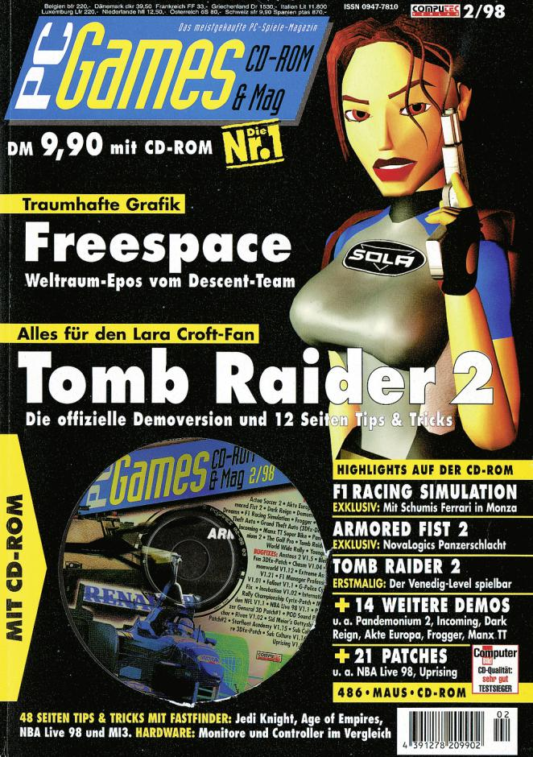
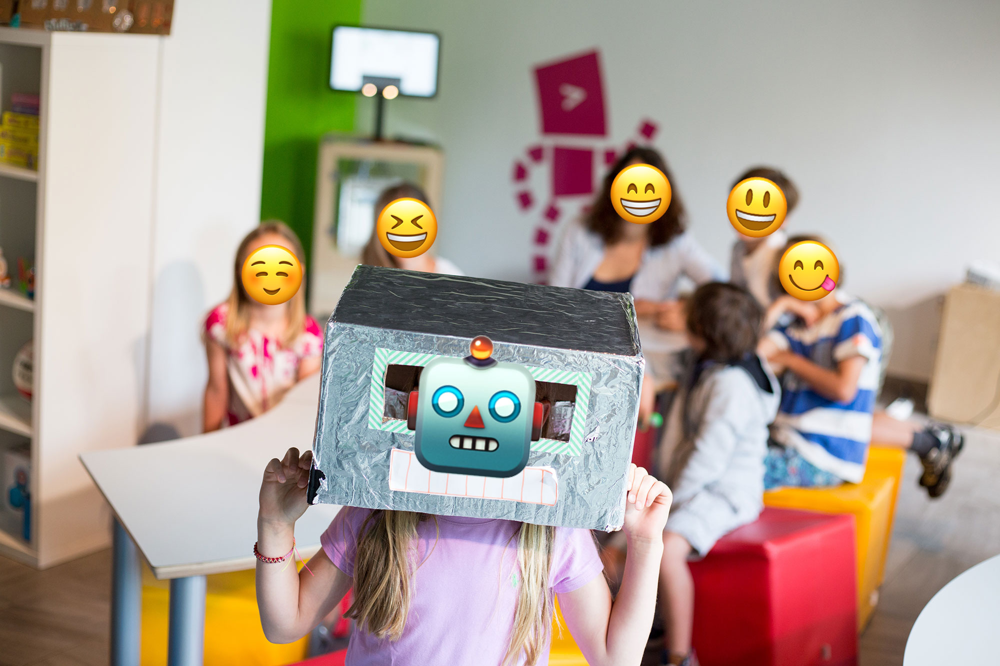

theme: Scherzkeks, 1
[.header: text-scale(0.5)]

^ Welcome to my talk Teaching coding to kids - why it matters and how to do it.

^ And just to make sure. In this presentation we talk about kids in the age of 6-12 years.

^ I hope you enjoy it.

# About
# [fit] Coding Kids
## and
# [fit] _**Screaming Carrots**_

---
# [fit] About me
+ Living in Munich, Germany
+ Principal Developer for Sinnerschrader
+ Origami Addicted
+ Kids Coding Trainer

---
[.background-color: #fdc552]

^ Let's go back to me as the coding kid.

^ I'm not the youngest anymore and nostalgia fun is guaranteed.

# [fit] *Nostalgia Fun*
## *with*
# [fit] *The coding kid*

---
^ So that you have some inner picture. That's me. I'm ten years old.

# [fit] That's me

---
^ It's 1994. I call this chapter of my life Magazine Hoarder

^ For a reason.

# [fit] **_1994_**
## [fit] Magazine Hoarder

---
^ At that time I love to play with my Super Nintendo and my Sega Game Gear.

---
^ My favourite place to be, month by month, is the store with the huge shelf of magazines.

# [fit] Favourite
# [fit] Place

---
^ I buy there a lof of magazines. Like Club Nintendo, PC Games and Total!

^ Those are magazines about consoles.

^ I bet some people here recognize those magazines.

---
^ It's 1995 now

^ and I'm buying even more magazines.

# [fit] **_1995_**
# [fit] Still a Hoarder
---
^ In addition to the gaming magazines

^ I also get those about computers like PC Welt, Chip and Ct.

^ This must have been a really expensive time for my parents.

---
^ Most magazines had some CD attached.

^ The ones about computers contained application, demos, drivers & patches.

^ Why? Because internet was not available to everyone and bandwidth was limited.

# [fit] Drivers
# &
# [fit] Patches
---
^ Could I use those CDs ? Not at all.

^ as I didn't even owned a computer.

^ But I still grew to a young computer expert for my family.

---
^ I only got in touch with real computers when visiting my friends to play games

^ Or when my older sister took me in her agency office.

^ There I had the opportunity to tinker around on a Mac running the wonderful OS 9.

^ Photoshop was my favourite application.

---
^ I created dozens of those galaxy spirals.

^ By using a combination of cloud effect, swirl, lightning effect and lens flare.

^ Whatever the kid would find in the effects section

---
^ Let's jump to 1997, the year of my first PC.

# [fit] **_1997_**
# [fit] My first PC
---
^ Actually I had to wait until Christmas 1997.

^ It's now three years since I bought my first computer magazine.

---
^ That computer was running Windows 95 on a Pentium MMX 200 Mhz with a 4GB hard disk.

^ This thing had of course no internet.

^ And what does a kid do with a computer ?

---
^ Of course. Playing games.

^ It's 1998 and I enjoy my new computer day and night.

# [fit] **_1998_**
# [fit] PC Gaming
---
^ My very first game I bought was Blade Runner from Westwood Studios.

^ It was distributed on 4 CDs and consumed half of my disk space.

---
^ Let's hurry to 1999. The year I got my internet access.

# [fit] **_1999_**
# [fit] Internet

---
^ I used a 56k modem to do so.

^ This was by the way slower than your throttled dataplan on your smartphone.

^ Let's listen to the iconic sound for a quick flashback.

^ After Video: I still can’t believe the internet worked back then.

---
^ I'm also watching that new tv station called  **NBC Giga**

^ Young moderators are talking about internet stuff, games and computer news.

^ Sure as hell I loved that tv station.

# _NBC Giga TV_

---
^ It must be somewhen around April 1999.

^ I'm at home from school before leaving for afternoon classes

^ This particular day two guys were showing a new application

---
^ There was a timeline where they could easily animate a red ball bouncing around.

^ Must have looked like this.

---
^ I was impressed

^ They mentioned the name of the application.

^ But I had to hurry back to school and didn't write it down.

^ After school I wanted to search for a demo version on my magazine cds.

# [fit] I was impressed

---
^ But I forgot the name.

^ The week went by quickly.

# [fit] **_I forgot the name_**

---
^ It is Saturday

^ This means getting up as early as possible

^ and watching series like Captain Future, Duck Tales or the gummybears.

^ Around lunch time..

---
^ .. I watched Giga TV again.

^ And I could not believe it.

^ It was the repeated show from earlier of the week.

---
^ I was frozen in front of my TV

^ I holded my breath

^ I waited for the moment they would tell me that name I forgot.

^ and then

---
^ There it was.

---
^ It was Macromedia Flash 4. Released just weeks before.

---
[.header: text-scale(0.5)]
^ This moment just now?

^ This was genesis of my programming career.

# [fit] Genesis
## of my
# [fit] **_programming career_**

---
^ Flash looked like this.

^ A timeline, some layers, a stage and some tools.

---
^ I quickly found the Actions panel.

^ It was the place to code.

---
^ Soon I was able to program the very famous Yugop Menu

^ This menu was named by Yugo Nakamura. He was a star of the flash scene.

^ It's an horizontal navigation with the illusion of infinity.

^ I was so good in programming this thing...

---
^ ...that I could sell it to agencies.

^ To earn my first money with 15 years.

---
^ It was an amazing time full of amazing websites

^ What you see here is THE PORTAL from derbauer.

^ Yes this was a website.

^ I was soooo impressed back then I and wanted to do the same.

---
^ By the way and just to remind you.

^ The web without flash?

^ It looked like that.

 
 

---
^ So what's my point you're asking?

# [fit] So what's my **_point_** ?

---
^ Remember the genesis of my programming career in front of the TV ?

^ I wish I would have had some guidance during school

^ So that more than a single moment would have guided me to my career.

---
^ Instead

^ The most digital thing I had in primary school was this

---
^ Later the computer classes I remember were more like this.

---
^ Computer classes today are still bad.

^ The hardware, if any, outdated

^ Most teachers are not educated

^ The curriculum is boring

---
^ I want to make a difference and change things
# [fit] Make a
# [fit] difference
---
^ That's why I'm teaching kids coding in my spare time

^ And I want you to know why I am doing this

^ and that you can do it too.

---
[.background-color: #fdc552]
^ So for the next 30 minutes I will talk about

^  1. Why coding matters.

^  2. How to teach it.

^  3. and where to teach it.

# [fit] _1. Why it matters_
# [fit] _2. How to teach_
# [fit] _3. Where to teach_

---
[.background-color: #fdc552]
^ So why does coding for kids matter at all?

^ Let's start with something easy.

# [fit] _1. Why it matters_
# 2. How to teach
# 3. Where to teach

---
^ We all can describe to a child how a combustion engine works more or less.

^ Right?

# _**combustion engine**_

---
^ We can tell how the human body works.

# _**human body**_

---
^ But when you a press the play button a youtube video.

# _**youtube play button**_
---
^ Yeah. What would you tell that kid :)

^ It's hard for many of us.

^ It's like something was missing in school.

^ So let's fix this for our children by...

# what would **_YOU_** tell that kid?

---
^ ...teaching - coding - to - kids-

^ The whole world is crazy about it.

^ Just listen carefully to media, hear parents talking, teachers demanding and politicians promising.

^ And even me, standing here, talking to you, is selling it as the solution for the play button thing.

> _"teaching **coding** to kids"_
-- mentioned by media, parents, teachers, politicians, well even me standing here

---
^ New York's former major Bloomberg even had a new year resolution promising to take coding courses.

---
^ Angela Merkel is talking about coding as the new literacy for young people besides reading, writing and math.

> _**"coding is the new literacy for young people"**_
-- Bundeskanzlerin Merkel, Digitalkonferenz, 2016 (liberally translated)

---
^ It even reaches levels like this.

^ Congressman Tony Cárdenas from Southern California introduced a bill called with exactly that name in 2013.

# [fit] 416D65726963612043616E20436F646520
# **_Act of 2013_**

---
^ It’s a string of 34 letters in ASCII hexadecimal code and translates to ”America Can Code."
# [fit] 416D65726963612043616E20436F646520
# [fit] _**America Can Code**_

---
^ All that shows that something is going on.

^ That the world is concerned about the future of our kids.

# [fit] Concerned

---
^ or that we fear that technology leaves us behind

^ and that our kids should fix it.

^ No matter what, the demand is the same...

# [fit] Fear of
# [fit] Technology

---
^ ...Our kids should learn coding.

^ Is this justified? Should our kids learn coding?

^ I’m biased in this question for obvious reasons.

^ So let me step back and let's look at the bigger picture.

# [fit] Kids
# **_should learn_**
# [fit] coding

---
^ We start by looking at a mechanic

^ and apply the whole coding discussion onto it.

^ It goes like this:

# [fit] _**The mechanic**_

---
^ It's sort of like an **obsession** with being an **auto mechanic**

<!-- This is mechanic comparison is coming from npr.org -->
# [fit] _**Obession**_

---
^ There are **tons of cars**, there's tons of **driving** ...

# [fit] **_Tons of cars_**

---
^ but I think it's a little **silly** to go around saying
#### little
## **_silly_**

---
^ that **everyone**  should **_really_** learn to be an auto mechanic
# [fit] _**Everyone**_

---
^ just because cars are so **_essential_** to the **functioning** of our society.

# [fit] **_Essential_**

---
^ Hell yeah! That would be silly indeed.

^ But what do we do?

# [fit] **_Oh Yeah!_**
# [fit] that would be silly indeed

---
^ There is tons of technology

^ and we go around and tell everybody how important coding is.

---
^ So are we silly then?

# [fit] ArE wE **_silly_**?!

---
^ Or..

^ Are we are just talking about something else than coding?

# OR..

---
^ What if the **word coding**, that is used so inflationary **is just blatantly wrong** ?
# [fit] ~~coding~~

---
^ The question is: What do people actually mean with coding.

# What do people actually mean with **_coding_** ?

---
^ Let me go back some years.

^ Do you know when the first programming language was invented?

# [fit] First
# [fit] Programming Language

---
^ In 1943 by Konrad Zuse

^ He just invented his famous Z3

^ And together with it the very first programming language.

# [fit] _**1943.** Konrad Zuse._

---
^ The Z3 looked like that.

^ Technology escalated then pretty quickly

---
^ With your smartphone you hold a device that combines everything we learned in the past 70 years.

^ That’s a lot and very complex

^ It makes computer science very difficult and not easy to talk about.

# [fit] _70 years later_
# **_Technology is complex_**

---
^ Coding on the other side is easy to grasp.

^ You frequently see it in movies and it's therefore easy explained.

# [fit] Coding?
## **_Sure, I know that from movies_**

---
^ Take someone

^ Add a keyboard

^ And watch that person giving commands to a computer.

^ That’s coding and the people understand it.

---
^ So if coding is such an easy word

^ Let’s try a thesis.

# Let's try a
# [fit] _**Thesis**_

---
[.header: text-scale(0.5)]
^ When people talk about coding they actually mean technology.
## When people talk about
# [fit] **_coding_**
## they actually mean
# [fit] **_technology_**

---
<!-- -- via kidscodecs.com -->

^ It's now about exposure to technology, computer and programming

^ Most of the kids will never be a coder anyway.

> **_Exposure to technology_**, computer science and programming.

---
^ Our children should learn that smartphones and technology are not magical.

^ That there are limitations, benefits and possibilities from using them.

## [fit] _no magic_

---
^ And everything suddenly makes sense.

# [fit]Everything
# **_suddenly makes sense_**

---
^ It was never about coding only.

^ When the people say "our kids need to learn coding"

^ they actually say "our kids need to learn technology"

^ so they can understand the bigger picture, the connecting lines.

# our kids need to learn
# [fit]  ~~coding~~ **_technology_**
---
^ You do this by teaching not only coding.

^ but also how the internet is functioning

^ how a roboter is build and controlled

^ How algorithms are working

^ and let them tinker around with electronics.
## Learn Coding &
## [fit] Internet, Robotics
## [fit] Algorithms, Tinkering

---
^ Coding is only one part of understanding technology

^ but you benefit in many ways when you learn to code.

## [fit] **_Benefits_**
## of
## [fit] Coding

---
^ It stretches your mind

^ and it creates a thinking which is useful in all domains.

> "Learning to write programs **_stretches your mind_**.."
-- Bill Gates

---
^ Coding boosts your creativity.

^ You can create worlds in the computer, you can try out ideas, you can tell stories.

^ The room for creativity is endless.

^ It’s like painting and music but often more accessible and affordable.

# [fit] Coding
## is like
# [fit] _**painting & music**_

---
^ Speaking of affordable. Coding gives you chances.

^ Computer's are cheap nowadays.

^ Even poor kids in every country can try it.

## [fit] Chances

---
^ Diversity. The computer just don't care who you are. Everybody can be a coder.

## [fit] Diversity

---
^ And coding gives your child another perspective about dreamjobs.

^ Just look at me. I wanted to be a policeman first, than a stockbroker to get rich

^ and now the coding kid became a programmer by watching TV.
## [fit] Perspective

---
[.background-color: #fdc552]
^ I hope I have convinced you by now why teaching coding matters

^ So let me show you some possibilities how to teach kids about technology and computer science.

# ~~1. Why it matters~~
# [fit] _2. how to teach_
# 3. where to teach

---
^ I will present you now a list of my favourite tools I love to use when teaching

^ Tinkering, Robots and actual Coding

# _**My favourite toolset**_

# [fit] Tinkering, Robots, Coding

---
[.background-color: #fdc552]
^ Let's have a look at Tinkering.

^ This is all about playing around with electronics.

## [fit] _Tinkering_

---
^ A drawbot.

^ This is an toy which every kid starting with 4 years can build.
## [fit] Drawbot

---
^ The parts cost less than 2 EUR

^ You have three legs made of pens, a battery and a motor with an unbalanced weight rotating.

^ Don't forget to decorate the bot so it looks like an animal and the like.

^ And then magic happens.

---
^ When activated the robot will vibrate

^ and start walking around drawing on the underlying surface

^ This looks like real art in the end

^ and is so much fun for the kids to watch their robot to be alive.

^ Let's go to the next topic.

---
^ A Makey Makey

^ Its simplicity is awesome.

## [fit] Makey Makey

---
^ It’s basically a board that pretends to be a keyboard.

^ You use the alligator clips to connect conductive objects with it

---
^ When closing a circuit you virtually press a key

^ And what can you do with it?

---
^ Well, make a banana piano.

^ Find some piano game where you can play with your keyboard keys.

^ Each banana will represent a single key on the keyboard

^ Connect them with Makey Makey

^ And play your bananas

---
^ A Super Mario Controller

^ Same here. Find a mario game with keyboard controls

^ Build your own controller with play dooh - which is suprisingly conductive.

^ Switch from the keyboard to your own device.

---
^ And another one. Let me introduce you to the Screaming carrot.

---
[.background-color: #fdc552]
^ Programable Robots!
## [fit] _Robots_

---
^ There are a lot of them out there.

^ Many of them can be programmed with child friendly programming language.

^ Let me show you some.

---
^ That's Ollie and Sphero.

^ Two different toys from the same brand

^ Connects through Bluetooth with your smartphone.

^ You can drive around with an app or program them.

^ Costs around 80 EUR

# [fit] OLLIE
# &
# [fit] Sphero

---
^ Say hello to Dash & Dot.

^ Those are more complex and expensive robots. Costs around 200 EUR

^ They have many sensors and can communicate with LEDs and speakers.

^ You use the apps Wonder or Blockly to program them.

# [fit] Dash
# &
# [fit] Dot

---
^ The wonder app is about exploring and adventures.

^ You don't create programs but you solve missions.

^ You solve those missions by linking behaviors about lights, sound or move.

---
^ On the other hand there is Blockly.

^ Blockly offers more of a coding experience by using blocks with text to make programs.

^ This gives the kid a focus on their own creativity.

---
^ Not hard to see that here comes my favorite.

^ It's mbot and I call him the master of all robots.

## [fit] mbot
## **_the master of all robots_**

---
^ He's made by Makeblock.

^ and based on Arduino uno

^ It's OpenSource which means all parts and all software can be used without paying money.

^ You can of course buy it as a package for 80 EUR.

---
^ What's so special about it ? That the kid will assemble it.

^ Usuallly within 20mins

^ You can then start an automatic program, use an app or code your own program.

---
^ When you activate the autonomous driving mode.

^ It will use its ultrasonic and special line sensor

^ to follow a line and avoid obstacles in front if it.

---
^ You can also program it yourself.

^ You use makeblocks own software called mBlock to write and upload the code.

---
^ Speaking of coding, let’s look how this is being teached.

^ You usually tackle it in three different parts.

^ Analog activity, playing games and dive into the actual coding experience.

## [fit] Coding

---
^ Let's look at the analog activity.

^ If you want to control a robot you have behave like a robot first.

^ So let's play the human robot game.

## [fit] The Human Robot

---
^ One kid or you dresses up as a robot.

^ A helmet is usually enough for the illusion but a full costume like this is never wrong.

^ You explain the kids in the round that they can only use five commands to control the robot.

^ forward, left, right, backward and stop

^ Let's begin

---
^ Imagine this task:

^ You want the robot to turn to the right and walk in that direction.

^ So you begin with a turn right, right?

^ Let's see what happens after the kids yell that command to the robot.

## $ROBOT: **_<TURN RIGHT>_**

---
^ The robot will spin forever and ever and ever of course.

^ The command was correct but not exact enough.

^ They should have said turn right - a quarter.

^ While spinning around, somebody will hopefully scream a `stooooop`.

---
^ In the end kids really love that game, collaborate and understand the limits of a machine

^ They also understand the requirement of exact commands

^ and to put one command after another - just like in programming.

---
^ Your crowd is ready for some more fun.

^ Let’s play some coding games on code.org.

^ Those games are themed after kid’s darlings like Ice Princess Elsa, Minecraft or Angry Birds.

^ And they teach them principals of programming while playing.

^ But wait.

## [fit] Coding
## [fit] Games

---
^ Some infos about Code.org.

^ Founded in 2013, code.org is a non-profit organization and was launched by Hadi and Ali Partovi

^ It is now supported by the largest companies around the world including amazon, facebook, microsoft & google.

## [fit] code.org
## **non-profit by Hadi and Ali Partovi**

---
^ They also created the movement Hour of Code

^ There are dozens of one-hour tutorials and games translated in 45 languages.

^ Everybody is encouraged to try it out.

## [fit] Hour of Code
## **_one-hour tutorials_**

---
^ Even a US president.

^ That's a photo from The White House where they hold an Hour Of Code event in 2014.

^ Hour of Code takes place every year from 4.-10. December.

---
^ Ok let's play a game

^ In every game there are multiple levels with increasing difficulty.

^ You slowly introduce conditionals (if-else), loops and new commands.

^ I usually pick a labyrinth style game to follow up with the human robot example.

^ This is the Zombie Level which is an intermediate level.

^ The zombie has to be guided to his favorite food.

^ A sunflower of course!

---
^ Commands are given with colorful blocks and snapped together like in a puzzle.

^ You use a simple set of commands to do so.

^ Like move forward, turn left, turn right

## [fit] _**Commands**_

---
^ Kids will usually place one command after the other

^ That's their idiomatic version and it's working

^ But it results in a huge list

^ They can’t even complete the level as they are forced to use a new block. The
 pink one here.

---
^ I then show them the pattern of 4 blocks.

^ forward, left, forward, right

^ and let them refactor their code to something very beautiful.

---
^ And success! They usually just know what to do.

^ Pick the loop block and place the repeating pattern inside.

^ I love this moment. I explain that this is what a computer is for.

---
^ The computer should repeat the boring stuff, it's not your task.

^ After an hour the kids should have internalized those block based commands...

---
^ and they are ready for Scratch to do some real coding.

^ Scratch can be used as an application and online in the web browser through flash.

^ Scratch 3.0 is in active development, based on HTML5 and will be released this August.

---
^ Scratch is the holy grail of kids programming.

^ It’s a programming language invented by Mitchel Resnick at the MIT Media Lab.

---
^ Everything you code can be shared on the Scratch website

^ and remixed by others as the `source code` is always accessible.

---
^ Let's have a look inside.

^ This is the start screen

^ 1. On the left you have a stage where everything will move around.

^ 2. And on the right you see the coding editor.

^ That’s where the **code will be written**.

---
^ Did I just say **written**? Nobody expects you to write a thing.

^ Every available command can be dropped in.

^ That is called block based programming.

---
[.background-color: #fdc552]
^ I have hopefully convinced you why coding matters and how to teach it by now.

^ What’s left is the question where **everybody** could try teaching it.

# ~~1. Why it matters~~
# ~~2. How to teach~~
# [fit] _3. Where to teach_

---
^ I want to stress the word everybody.

^ You don’t have to be a programmer

^ Everybody can learn coding and everybody can teach about coding or robots.

# [fit] **_Everybody_**
# can
# [fit] teach

---
^ I started teaching coding to kids in my spare time exactly a year ago at Haba Digitalwerkstatt.

^ Haba is a famous toy manufacturer in Germany. Digitalwerkstatt is a 100% subsidiary of them.

^ Digitalwerkstatt translates to digital garage.

^ They opened in the beginning of 2017 in Munich after being very successful in Berlin during 2016.

# [fit] Digitalwerkstatt

---
^ There are regular courses and one-off workshops for children from 5 to 14 years about coding, robotics, stop motion movies, even exploring worlds in Minecraft.

^ If you want to try it, just drop them a mail like I did.

---
## [fit] Hour of Code
^ You could also host an Hour of Code yourself

^ Play games and explain the basics of programming to interested people

---
^ Hour of code can be hosted all year.

^ You might even find some Hour of Code in your hometown. Try to join and get in touch with the organizers.

---
^ Don't forget your family at home.

^ You can start teaching your own kids and relatives easily with the tools I have shown you.

# [fit] At home

---
^ You won't believe it but designers, project managers or maybe you client are eager to learn coding too.

^ Start by teaching them the basics

^ They will understand you better the next time you talk about bit & bytes

# [fit] office

---
[.background-color: #fdc552]

^ Good. Let's go to the concl..
# [fit] _Conclu.._
---

[.background-color: #fdc552]

^ Wait.

^ What about me, the teacher? What do I get??

# _ehh, what about me?_
# [fit] _Your benefits_

---
^ Well. When did you play with toys for no reason the last time?

^ It' healthy, it relaxes your mind.

^ and it entertains the kid inside you.

^ By teaching about coding

^ You are excused to play with toys

^ You are excused to program stupid jokes

^ And you can finally try out Minecraft

# Entertain
# [fit] the kid
# inside you

---
^ To think about what to do with a MakeyMakey

^ to create challenging tasks in Minecraft for kids

^ and to use Scratch for yourself to surprise your Mama on Mother's day.

^ Teaching coding makes you more creative.

# [fit] Be more
# [fit] creative

---
greeting cards example

---
^ Mentoring is hard. You have to explain things that are obvious to you.

^ Did you ever try to explain if & else to your mother?

^ I explain it slowly and repetetive to kids. It's so hard.

^ Expect nothing and start from scratch.

^ You have to reflect on the very, very basics of programming

^ This will help you throughout your whole mentoring career!

# [fit] Supercharge
# [fit] your mentor skills

---
^ Working with kids is fun.

^ I had an amazing time and I was surprised

^ about all the funny ideas they had!

# [fit] Fun

---
^ Kebap Heist

---
^ The Pig Road

---
[.background-color: #fdc552]
^ Why it matters, how to teach and where to teach.

^ You have a bag full of knowledge now. Use it.

^ A quick recap of what I have told you

# [fit] _Conclusion_

---
[.background-color: #fdc552]
^ Coding matters because..
# [fit] _1. Coding matters_

---
^ it was never about coding only.
## It was never about **_coding_** only

---
^ ... it's about being exposed to technology, computer science and programming.

## [fit] exposure

---
^ ...it's about the big picture and connecting the lines between technologies

## [fit] big picture

---
^ ...it's about giving chances. Computer's are cheap so many can afford it.

## [fit] chances

---
^ ...it's about diversity. No computer cares who you are.

## [fit] diversity

---
^ And it boosts creativity and learns a thinking useful in all domains

## [fit] creativity

---
[.background-color: #fdc552]
^ You know how to do it.
# [fit] _2. You know how_

---
^ By building Drawbots and using MakeyMakey to explore the world of banana pianos
## [fit] Tinkering
## [fit] with **_Makey Makey and Drawbot_**

---
^ You also know that there a robots for kids

^ Robots like dash & dot or mbot that are easily programmable.

## [fit] Robots
## like **_Dash, Dot & mbot_**

---
^ and by playing hour of code on code.org you make the transition

^ from the human robot to scratch to unleash their creativity

## [fit] Coding
## **_Human robot, Maze Games and Scratch_**

---
[.background-color: #fdc552]
^ And you know where you can teach too!

# [fit] _3. You know where_

---
^ At Haba Digitalwerkstatt, the place I started with locations around germany

# [fit] Digitalwerkstatt

---
^ Start by hosting yourself a hour of code event

## [fit] Hour of Code

---
^ Don't forget you can always start teaching at home.

## [fit] At Home

---
^ And make your designer's happy by teaching them a bit about coding.

## [fit] Office

---
^ You have personal benefits by teaching too

[.background-color: #fdc552]

# [fit] _You benefit too!_

---
^ be a kid again and enjoy playing with toys again

## [fit] kid again

---
^ be creative by creating challenges for the kids and sending scratch greeting cards

## [fit] be creative

---
^ Supercharge your mentoring skills

^ by thinking about the every basics again

## [fit] mentoring skills

---
^ And hanging around with kids is fun. I would have never know about the Kebap Heist.

## [fit] Fun

---
[.background-color: #fdc552]
^ One last thing I want to tell

^ I still remember my very first time I teached kids in the Digitalwerkstatt.

# [fit] _One last thing_

---
^ The glowing in their eyes when they connected the pieces and finally understood what I teached them.

^ This is the reason I stand in front of you today

^ I want you to experience the same and help some kids finding their way through technology.

^ Everybody can teach it.

---
^ Thanks

^ Slides & compiled linklist

# [fit] Thanks
- by Georgios Kaleadis

Slides & Linklist:
_georgiee.github.io/coding-for-kids_

